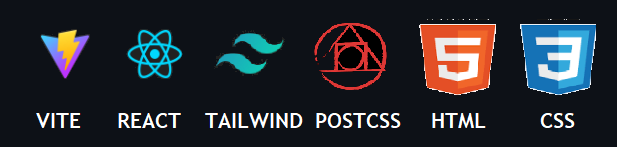
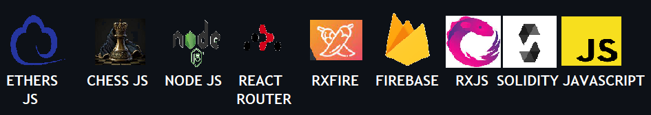

# ONLINE WEB 3.0 CHESS-APP

This code repository contains an app where you can play chess offline and also online by sharing the game's link. The upcoming updates will let you bet using crypto for each game and also play with a chess bot.   
For now I have implemented transfer of crypto by connecting metamask accounts. This is still an unfinished project so chill out!   
I would like to thank Sebastian Lague, whose videos inspired me very much to do this project. I won't thank my friend Prem for introducing me to chess because I can't thank a friend for being a friend, but yeah you get it right **:)**     

## Update-2 08|10|23:

Implemented minimax algorithm optimised with alpha-beta pruning and Move ordering. The algorithm is slow due to the code running in javascript...maybe the same code could be rewritten in c++ and run in the backend....would make it much faster. The algorithm is still buggy(problem with the minimax search function) and minor tweak to it would create a major impact in its output. For now it can capture moves and also prevent a basic Scholar's mate. More work to be done...

## Update-1 25|09|23:

The play with computer mode is now functional, but it has been set to make completely illogical random valid moves. More updates to roll over... 

## Dependencies

### FRONTEND

### BACKEND

     
### HARDHAT

## How to use
Download the github repository to your computer. Install node js from the internet. Go to terminal and change the directory to where you have downloaded the repository and change your directory to the client file:

`cd client`

Then type out:

`npm install`

After all the required packages are installed from the package.json, type:

`npm run dev`

A localhost will be created and if u go to the link, you can use the website.

## Home Page

As soon as you enter the website you would get a pop-up from metamask asking you to connect your wallet to the app. If you don't have metamask, you will be prompted to do so. You can create an account and download 
metamask from chrome web store.

As soon as you link your metamask account you can view the webpage.

Click on "Play Game", you would be routed to the Game Select Page.

# Local Game Page

Once Player 1 makes a move, the board flips and waits for Player 2 to make a move.

# Online Game

If you select online game option in the Game Select Page then you will be routed to a new page which asks you to enter your name.

You will be routed to a page which asks you to select a piece: white, black or random.

You will be routed to a new GamePage with a link that has a unique id. Share this link to your friend and once your friend opens the link from another device, your game starts.

At the endgame, your page would look like this:

